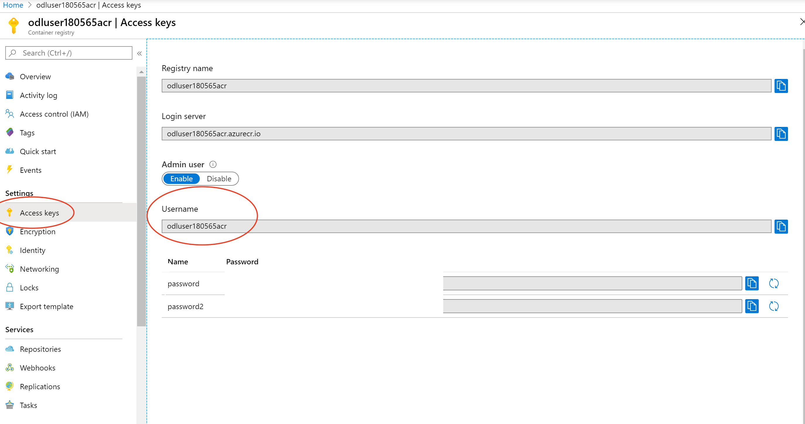

### Deploy Azure Container Registry
**Approx. time to complete this section: 30 minutes**

In this step, we will deploy an instance of Azure Container Registry (ACR) to store container images which we will build in later steps.  A container registry such as ACR allows us to store multiple versions of application container images in one centralized repository and consume them from multiple nodes (VMs/Servers) where our applications are deployed.

1.  Login to your Azure portal account.  Then click on **Container registries** in the navigational panel on the left.  If you don't see this option in the nav. panel then click on **All services**, scroll down to the **COMPUTE** section and click on the star beside **Container registries**.  This will add the **Container registries** option to the service list in the navigational panel.  Now click on the **Container registries** option.  You will see a page as displayed below.

    

2.  Click on **Add** to create a new ACR instance.  Give a meaningful name to your registry and make a note of it.  Select an Azure **Subscription**, select the **Resource group** which you created in [Section A](#a-deploy-an-azure-sql-server-and-database) and leave the **Location** field as-is.  The location should default to the location assigned to the resource group.  Select the **Basic** pricing tier (SKU).  Click **Create** when you are done.

    **IMPORTANT NOTES:**
    - Keep in mind, you will need an **Premium** SKU ACR instance in order to work on *Exercise 4*.  Hence select the **Premium** SKU if you intend to work on this challenge later.

    
3. Enable login access via access keys 
 
 Log into ECR repo from your machine 
    ```bash
    az acr login --name <registry name>
    ```
4. Tag your docker images to latest 
    ```bash
    docker tag claims-api <registry name>.azurecr.io/claims-api:latest
    ```    
5. Tag your docker images to latest 
    ```bash
    docker push <registry name>.azurecr.io/claims-api:latest
    ```        
6. Validate that you can pull image from the repo    
    ```bash
    docker pull <registry name>.azurecr.io/claims-api
    ```     
   
*** Done ****
