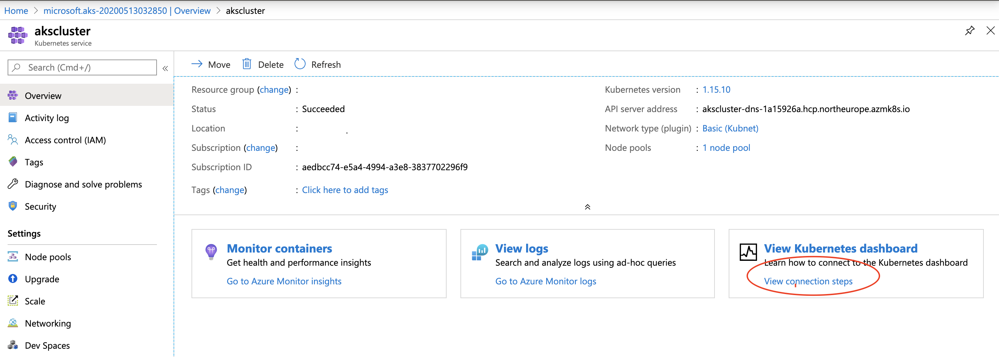

### Create an Azure Kubernetes Service cluster and deploy Claims API microservice
**Approx. time to complete this section: 1 Hour**

In this step, we will first deploy an AKS cluster on Azure.  We will then use **Helm** package manager CLI to deploy the Claims API microservice on AKS.

Helm has become the de-facto tool for managing the lifecyle of containerized applications on Kubernetes.  With Helm, Kubernetes resources for a given application are packaged within a *Chart*.  When a Chart is deployed to Kubernetes, Helm creates a new *Release*.  A given Chart can be updated and deployed multiple times.  Each deployment creates a new *Revision* for the release.  A specific deployment can also be rolled back to a previous revision and/or deleted.  A Chart can also be deployed multiple times (multiple releases).  We won't be discussing the internals of Helm as it is beyond the scope of this project.  Refer to the Helm documentation for details (Links provided above).

Helm Chart templates for deploying the Claims API (`claims-api`) container on AKS are provided in the `./claims-api` folder in this GitHub repository.  Before proceeding with the next steps, feel free to inspect the resource files in the Helm Chart directory.  Kubernetes resources (Object definitions) are usually specified in manifest files (yaml/json) and then submitted to the API Server.  The API server is responsible for instantiating corresponding objects and bringing the state of the system to the desired state. Review the Kubernetes manifest files under the `./claims-api/templates` sub-directory.

Follow the steps below to provision the AKS cluster and deploy the Claims API microservice.
1.  Ensure the *Resource provider* for AKS service is enabled (registered) for your subscription.

    A quick and easy way to verify this is, use the Azure portal and go to *->Azure Portal->Subscriptions->Your Subscription->Resource providers->Microsoft.ContainerService->(Ensure registered)*.  Alternatively, you can use Azure CLI to register all required service providers.  See below.
    
    ```bash
    $ az provider register -n Microsoft.Network
    $ az provider register -n Microsoft.Storage
    $ az provider register -n Microsoft.Compute
    $ az provider register -n Microsoft.ContainerService
    ```

2.  Check Kubernetes CLI version and available AKS versions.

    (If you haven't already) Open a SSH terminal window and login to the Linux VM (Bastion host).  Refer to the command snippet below.
    ```bash
    # Check if kubectl is installed OK
    $ kubectl version -o yaml
    #
    # List the AKS versions in a specific (US West 2) region
    $ az aks get-versions --location westus2 -o table 
    ```

3.  Provision an AKS cluster.

    >**NOTE:** If using the lab account then refer back to the initial service account and the resource names at inital setup time.
       Refer to the commands below to create the AKS cluster.  It will take a few minutes (< 10 mins) for the AKS cluster to get provisioned. 
       ```bash
       # Service Principal Details
       # Application/Client Id :  xxxxx-xxxx-xxxx-xxxx-xxxxxxxxx
       # Application Display Name: https://odl_user_sp_xxxxx
       # Application Secret Key: xxxxxxxxxxx
       # Subscription Id: xxxxxx-xxx-xxxx-xxxx-xxxxxxxx
       # Tenant Id: cxxxxxx-xxx-xxxx-xxxx-xxxxxxxx
       # Tenant Domain Name: msazurelabs.onmicrosoft.com
       $ az aks create --resource-group myresourcegroup-xxxxxx \
                --name akscluster 
                --location westus2 
                --node-count 2 
                --dns-name-prefix akslab 
                --generate-ssh-keys 
                --disable-rbac 
                --kubernetes-version "1.15.10" 
                --service-principal {Application/Client Id} 
                --client-secret {Application Secret Key} 
                --attach-acr {repo name}.azurecr.io
       #
       # Verify status of AKS cluster
       $ az aks show -g myresourcegroup-xxxxxx -n akscluster --output table
       ```
4. Log into Azure portal to verify that cluster was indeed created
5. Using the dashboard follow the command to install the dashboard. You can also navigate to it from the cluster's main page as shown below  

    ```bash
         az aks install-cli
         az aks get-credentials --resource-group myresourcegroup-xxxxxx --name akscluster
         az aks browse --resource-group myresourcegroup-xxxxxx --name akscluster    
     ```        

**** Pause  *****
#### Installing Helm on your machine 
Helm (https://helm.sh/docs/intro/install/) is a the deployment tool of choice for Kubernetes deployment. 
1. For windows users you can install Helm using Chocolatey package manager
    ```bash
       choco install kubernetes-helm
      ```         
2. Connect to the AKS cluster and initialize Helm package manager.
    ```bash
    # Configure kubectl to connect to the AKS cluster
    $ az aks get-credentials --resource-group myresourcegroup-xxxxxx --name akscluster
    #
    # Check cluster nodes
    $ kubectl get nodes -o wide
    #
    # Check default namespaces in the cluster
    $ kubectl get namespaces
    #
    # Check if Helm client is able to connect to Tiller on AKS.
    # This command should list both client and server versions.
    $ helm version
    Client: &version.Version{SemVer:"v2.16.3", GitCommit:"e13bc94621d4ef666270cfbe734aaabf342a49bb", GitTreeState:"clean"}
    ```       
 3. Use Helm to deploy the Claims API microservice container on AKS.

A kubernetes Namespace is a container object used to group applications and their associated resources. We will be deploying the Claims API microservice container within the development namespace.Refer to the commands below.

    ```bash
    # Make sure you are in the *aks-aspnet-sqldb-rest* directory.
    $ cd ~/git-repos/aks-aspnet-sqldb-rest
    #
    # Use Helm to deploy the Claims API microservice on AKS.  Make sure to specify -
    #   - Name of ACR repository in parameter 'image.repository'.  Substitute the correct value for the name of your 
    #     ACR.
    #     eg., --set image.repository=<your-acr-repo>.azurecr.io/claims-api
    #
    #   - Azure SQL Server DB Connection string in parameter 'sqldb.connectionString'.  Remember to
    # substitute the correct values for SQL_SRV_PREFIX, SQL_USER_ID & SQL_USER_PWD.
    #
    #     eg., --set sqldb.connectionString="Server=tcp:#{SQL_SRV_PREFIX}#.database.windows.net;Initial Catalog=ClaimsDB;Persist Security Info=False;User ID=#{SQL_USER_ID}#;Password=#{SQL_USER_PWD}#;MultipleActiveResultSets=False;Encrypt=True;TrustServerCertificate=False;Connection Timeout=30;"
    #
    #   - Enable/Set deployment type to 'blue'
    #     eg., --set blue.enabled=true
    # 
    $ helm upgrade aks-aspnetcore-lab ./claims-api --install --namespace development --set blue.enabled=true --set image.repository=<your-acr-repo>.azurecr.io/claims-api --set sqldb.connectionString="Server=tcp:#{SQL_SRV_PREFIX}#.database.windows.net;Initial Catalog=ClaimsDB;Persist Security Info=False;User ID=#{SQL_USER_ID}#;Password=#{SQL_USER_PWD}#;MultipleActiveResultSets=False;Encrypt=True;TrustServerCertificate=False;Connection Timeout=30;"
    #
    # List the Kubernetes namespaces.  Verify that the 'development' namespace got created.
    $ kubectl get namespaces
    #
    # List the application releases
    $ helm ls
    #
    # List the pods in the 'development' namespace
    $ kubectl get pods -n development
    #
    # Check the deployed Kubernetes service
    $ kubectl get svc -n development
    #
    ```
